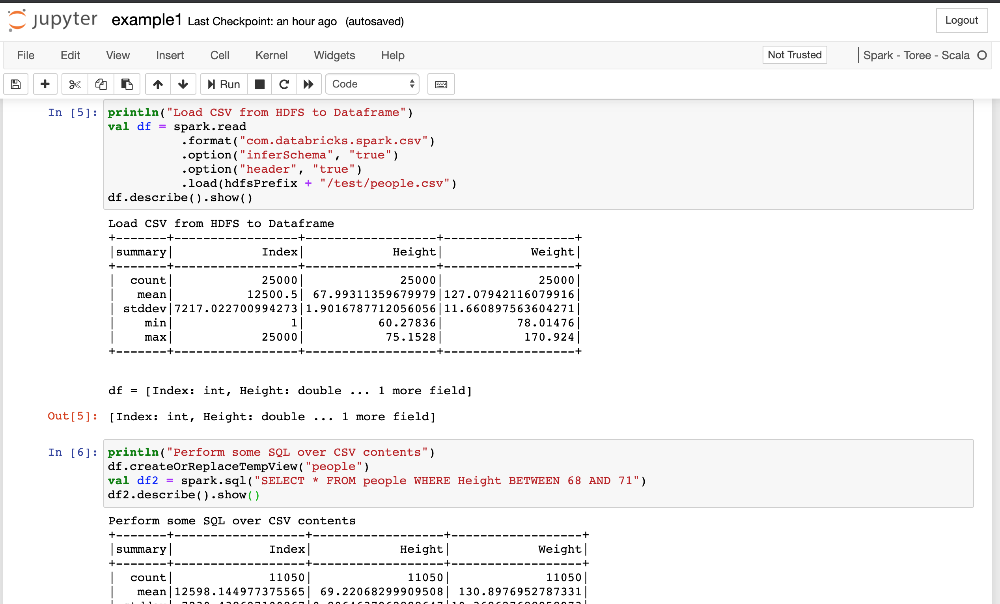

# spark-scala-jupyter

Jupyter notebook server prepared for running Spark with Scala kernels on a remote Spark master

See a **[complete example](/example)** of running the Spark/Scala Notebook using custom jars, SBT packaging, clustered HDFS, Scala with data visualization on Notebooks etc at [/example](/example)

Check for a [demonstration video here](https://youtu.be/ASMh0yHJZls)



## Usage

* Create docker-compose.yml

```yml
version: "3.5"
services:
  spark-scala-jupyter:
    image: flaviostutz/spark-scala-jupyter
    ports:
      - 8888:8888
      - 6006:6006
    # volumes:
    #   - /notebooks:/notebooks
    environment:
      - JUPYTER_TOKEN=flaviostutz
      - SPARK_MASTER=spark://spark-master:7077

  #SPARK SERVICES
  spark-master:
    image: bde2020/spark-master:2.4.5-hadoop2.7
    ports:
      - "8080:8080"
      - "7077:7077"
    environment:
      - INIT_DAEMON_STEP=setup_spark
      - SPARK_PUBLIC_DNS=localhost

  spark-worker:
    image: bde2020/spark-worker:2.4.5-hadoop2.7
    environment:
      - SPARK_MASTER=spark://spark-master:7077
      - SPARK_PUBLIC_DNS=localhost
```

* Run ```docker-compose up -d```

* Open Jupyter at http://localhost:8888

* Create a new Notebook with kernel Scala Spark Toree with contents

```scala
import org.apache.spark.SparkConf
import org.apache.spark.sql.SparkSession
import org.apache.spark.sql.SaveMode

import org.apache.hadoop.conf.Configuration
import org.apache.hadoop.fs.FileSystem
import org.apache.hadoop.fs.Path

println("Initializing Spark context...")
val conf = new SparkConf().setAppName("Example App")
val spark: SparkSession = SparkSession.builder.config(conf).getOrCreate()

println("************")
println("Hello, world!")
val rdd = spark.sparkContext.parallelize(Array(1 to 1000))
println(rdd.count())
println("************")
```

* Open Spark Master UI at http://localhost:8080

* View running App (from Jupyter notebook execution!)

### ENVs

* JUPYTER_TOKEN - password for accessing notebook server. defaults to ''
* SPARK_MASTER - Spark mastery location for submiting Spark jobs. ex.: 'spark://spark-master:7077'. defaults to 'local[*]'
* HDFS_URL - HDFS nameserver url to be used by Spark. ex.: hdfs://namenode1:8020. defaults to ''

## Some Jupyter Visualizations with Scala

* With Vegas - https://github.com/vegas-viz/Vegas

```
%AddDeps org.vegas-viz vegas_2.11 0.3.11 --transitive
%AddDeps org.vegas-viz vegas-spark_2.11 0.3.11
implicit val render = vegas.render.ShowHTML(kernel.display.content("text/html", _))
import vegas._
import vegas.data.External._

Vegas("A simple bar chart with embedded data.").
  withData(Seq(
    Map("a" -> "A", "b" -> 28), Map("a" -> "B", "b" -> 55), Map("a" -> "C", "b" -> 43),
    Map("a" -> "D", "b" -> 91), Map("a" -> "E", "b" -> 81), Map("a" -> "F", "b" -> 53),
    Map("a" -> "G", "b" -> 19), Map("a" -> "H", "b" -> 87), Map("a" -> "I", "b" -> 52)
  )).
  encodeX("a", Ordinal).
  encodeY("b", Quantitative).
  mark(Bar).
  show
```
